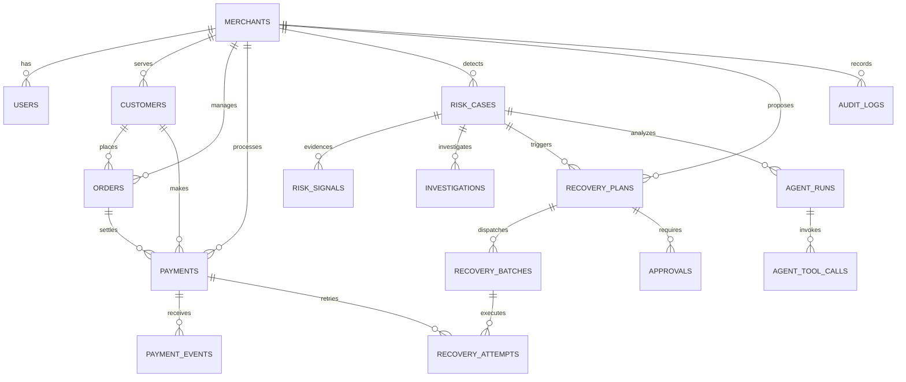

# RecoverAI — Production PostgreSQL Database & Domain Data Layer

## 1. Database Overview

RecoverAI utilizes a normalized, multi-tenant relational schema on **PostgreSQL 16** with **SQLAlchemy 2.x (asyncpg)** and **Alembic** migrations. The schema is engineered to guarantee financial precision, strict tenant data isolation, non-cascading audit protection, and operational telemetry recording.

---

## 2. Entity Relationship (ER) Diagram



---

## 3. Tables & Domain Models

| Table Name | Description | Primary Key | Key Relationships / Foreign Keys |
|---|---|---|---|
| `merchants` | Registered corporate tenants on RecoverAI | `id` (UUID) | Root tenant entity |
| `users` | Merchant team members & admin roles | `id` (UUID) | `merchant_id` → `merchants.id` (CASCADE) |
| `customers` | End-consumer buyer accounts | `id` (UUID) | `merchant_id` → `merchants.id` (RESTRICT) |
| `orders` | Commerce purchase orders | `id` (UUID) | `merchant_id`, `customer_id` → `customers.id` |
| `payments` | Transactions processed through gateway | `id` (UUID) | `merchant_id`, `order_id`, `customer_id` |
| `payment_events` | Raw inbound webhook payloads & events | `id` (UUID) | `merchant_id`, `payment_id` → `payments.id` |
| `risk_cases` | Detected revenue leakage incidents | `id` (UUID) | `merchant_id` → `merchants.id` (RESTRICT) |
| `risk_signals` | Deterministic telemetry metrics & evidence | `id` (UUID) | `risk_case_id` → `risk_cases.id` (CASCADE) |
| `investigations` | Structured AI diagnostic conclusions | `id` (UUID) | `risk_case_id` → `risk_cases.id` (CASCADE) |
| `recovery_plans` | Bounded policy recovery proposals | `id` (UUID) | `merchant_id`, `risk_case_id` → `risk_cases.id` |
| `recovery_batches` | Dispatched execution batches | `id` (UUID) | `merchant_id`, `recovery_plan_id` → `recovery_plans.id` |
| `recovery_attempts` | Individual transaction retry actions | `id` (UUID) | `merchant_id`, `recovery_batch_id`, `payment_id` |
| `approvals` | Merchant admin authorizations | `id` (UUID) | `merchant_id`, `recovery_plan_id` → `recovery_plans.id` |
| `audit_logs` | Immutable cryptographic ledger entries | `id` (UUID) | `merchant_id` → `merchants.id` (RESTRICT) |
| `agent_runs` | AI diagnostic session metadata | `id` (UUID) | `merchant_id`, `risk_case_id` → `risk_cases.id` |
| `agent_tool_calls` | Technical tool execution logs | `id` (UUID) | `agent_run_id` → `agent_runs.id` (CASCADE) |

---

## 4. Key Financial Constraints & Invariants

1. **Exact Currency Decimal Precision:**
   - All currency values (`amount`, `revenue_at_risk`, `estimated_recoverable_revenue`, `actual_recovery`, `maximum_exposure`) use `NUMERIC(18, 2)` / Python `Decimal`.
   - Never use `FLOAT` or `DOUBLE PRECISION` for currency.
2. **Check Constraints:**
   - `chk_orders_amount_positive`: `amount >= 0`
   - `chk_payments_amount_positive`: `amount >= 0`
   - `chk_risk_cases_revenue_at_risk_positive`: `revenue_at_risk >= 0`
   - `chk_risk_cases_recoverable_positive`: `estimated_recoverable_revenue >= 0`
   - `chk_risk_cases_confidence_range`: `0 <= confidence_score <= 1`
   - `chk_recovery_plans_threshold_range`: `0 <= failure_threshold <= 1`
   - `chk_recovery_attempts_number_positive`: `attempt_number > 0`
3. **Unique Constraints & Idempotency:**
   - `users`: `(merchant_id, email)`
   - `customers`: `(merchant_id, external_customer_id)`
   - `orders`: `(merchant_id, external_order_id)`
   - `payments`: `(merchant_id, external_payment_id)`
   - `payment_events`: `event_id` (Unique webhook deduplication)
   - `risk_cases`: `(merchant_id, case_reference)`
   - `recovery_batches`: `idempotency_key` (Unique batch dispatch lock)
   - `recovery_batches`: `(merchant_id, batch_reference)`
   - `recovery_attempts`: `(recovery_batch_id, payment_id, attempt_number)`

---

## 5. Index Strategy

Indexes are applied deliberately to support core filtering and high-frequency operational queries:
- **Tenant Scope:** Every tenant table indexes `merchant_id`.
- **Status Filtering:** `ix_payments_merchant_status`, `ix_risk_cases_merchant_status`, `ix_recovery_batches_merchant_status`.
- **Telemetry Querying:** `ix_payments_merchant_method`, `ix_payments_merchant_bank`, `ix_payments_merchant_created_at`.
- **Audit & History:** `ix_audit_logs_merchant_resource`, `ix_audit_logs_merchant_created_at`.

---

## 6. Multi-Tenancy Architecture

Every tenant entity is strictly isolated by `merchant_id`.
All repository queries enforce tenant isolation:
```python
# Tenant-safe repository query:
stmt = select(Payment).where(
    Payment.id == payment_id,
    Payment.merchant_id == merchant_id,
)
```
Cross-tenant retrieval attempts safely return `None` or raise `NotFoundException`.

---

## 7. Migration & Seed Instructions

### Run Alembic Migrations:
```bash
alembic upgrade head
```

### Rollback Migration:
```bash
alembic downgrade -1
```

### Run Deterministic Seed Script:
```bash
python -m app.db.seed
```
*Note:* The seed script is **100% idempotent**; running it multiple times performs zero duplicate inserts.

### Run Test Suite:
```bash
pytest -v
```
All 22 unit, model, constraint, tenant isolation, and repository tests execute against an async in-memory SQLite fixture with full schema creation.
